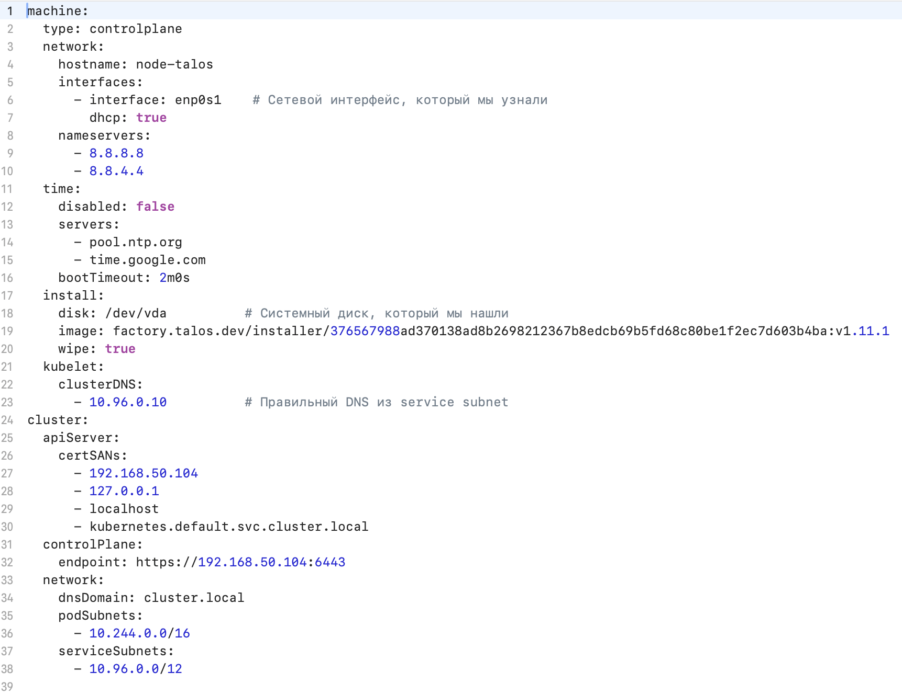
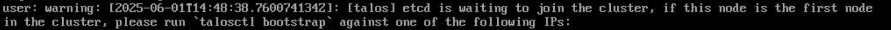
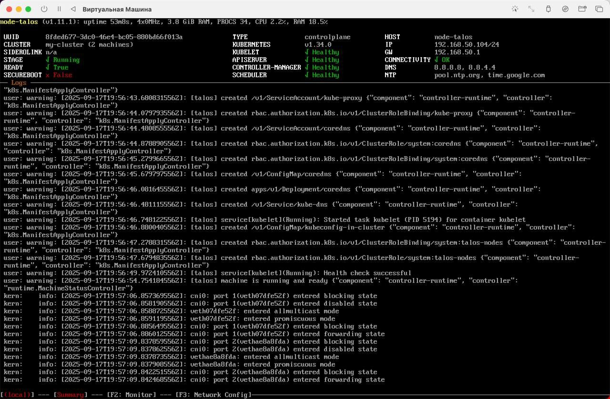
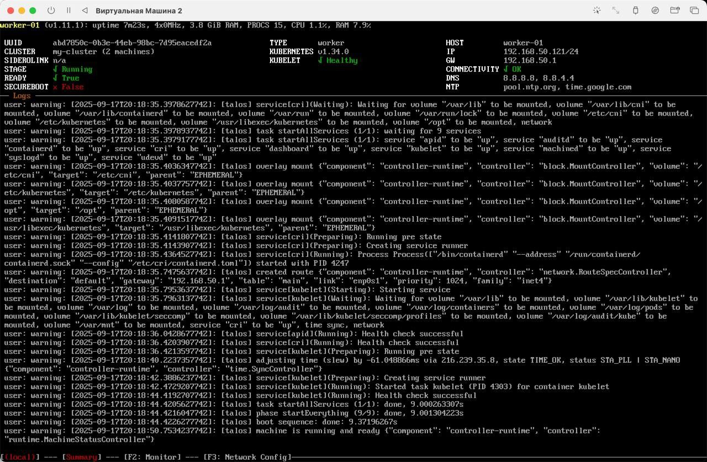
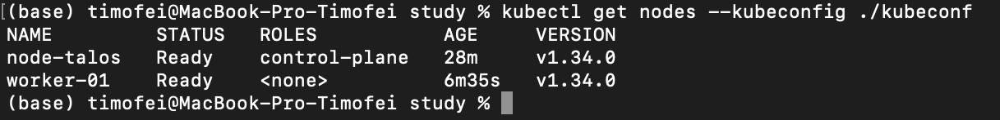

# Talos
## Поднимаем кластер k8s на Talos Linux

Основная цель — познакомиться с Talos.
### Преимущества Talos Linux
1. Иммутабельность: Корневая файловая система доступна только для чтения после загрузки, что обеспечивает целостность системы и предотвращает несанкционированные изменения.

2. Минимализм и безопасность: В системе присутствует только необходимый минимум компонентов для работы Kubernetes, что снижает количество потенциальных уязвимостей.

3. Управление через API: Взаимодействие с системой осуществляется исключительно через gRPC API, защищённый mTLS, что обеспечивает безопасное и централизованное управление.

4. Оптимизация под Kubernetes: Talos предназначен исключительно для запуска Kubernetes и его компонентов, что делает систему более стабильной и предсказуемой.

### Подготовка к развертыванию кластера
Для начала нужно установить talosctl - утилита командной строки, с помощью которой мы будем управлять узлами кластера. 
Для этого выполним команду 

```curl -sL https://talos.dev/install | sh ```

Далее нам нужно скачать образ, перейдем по ссылке: [Образы Talos](https://github.com/siderolabs/talos/releases) 

В моем случае я выбрал версию <u>1.10.7</u> и образ  <u>metal-arm64.iso</u>, так как использую мак.

Далее в UTM(так как он подходит для запуска на маках чипа Silicon) ссоздадим 2 виртуальные машины с базовыми настройками под линукс, только вмместо образа линукс - используем образ Talos.

После этого вся работа будет вестись из терминала хост машины, потому что Talos - это иммутабельная система и в виртуальных машиных делать мы ничего не можем(ну или почти). 

1. Генерация секретов
Создайте файл secrets.yaml, содержащий сертификаты и ключи для кластера:

```talosctl gen secrets --output-file secrets.yaml```

После чего нам необходимо создать базовые config файлы. Выполним следующую команду:

```talosctl gen config --with-secrets ./secrets.yaml us-k8s https://<Реальный IP адрес вашей ВМ>:6443```

Порт **6443** — это стандартный TCP-порт, на котором работает **Kubernetes API-сервер**. Через него проходят все команды и запросы к кластеру: от администраторов (например, через `kubectl`) и от внутренних компонентов Kubernetes (kubelet, контроллеры, scheduler). По сути, это «входная точка» для управления кластером, и именно к этому порту обращаются для конфигурации, мониторинга и взаимодействия с Kubernetes.

После выполнения команды в нашей директории появится три файла: controlplane.yaml, worker.yaml, talosconfig.

Далее нам необходимо создать патчи для файла controlplane.yaml. Патч-файл, в котором мы размещаем основную информацию о ноде встраивается в основной конфиг, для того чтобы создать измененную конфигурацию (которая в последующем будет использоваться нашими нодами. Первое что нам нужно узнать, чтобы составить правильный файл патча — какой у нас сетевой интерфейс и диск. Узнать два этих параметра можно командами:

```talosctl -n 10.10.10.10 -e 10.10.10.10 get disks –insecure```

```talosctl -n 10.10.10.10 -e 10.10.10.10 get links –insecure```

Мы узнали параметры железа нашей машины, и можем приступать к написанию патча для *controlplane* ноды. Ниже приведен пример, который мы написали:



Мы должны соединить патч с controlplane файлом. На выходе мы получим запатченный .yaml файл, который уже сможем применить на нашу первую ноду. Делаем это следующей командой:

```talosctl machineconfig patch controlplane.yaml --patch patch.controlplane.yaml -o controlplane_patched.yaml```

Теперь с уверенностью можем применить пропатченный файл к нашей первой машине. Делаем это командой:

```talosctl apply-config -n <IP ВМ1> -e <IP ВМ1> --file ./controlplane_patched.yaml  --insecure```

Когда увидели эту запись в логах запущенной ВМ: 



```talosctl bootstrap --nodes <IP ВМ1> -e <IP ВМ1> --talosconfig ./talosconfig```

После выполнения команды STAGE изменится на Running. Дополнительно появится состояние компонентов APISERVER, CONTROLLER-MANAGER, SCHEDULER. Выглядит это примерно так:



Важное уточнение: команда talosctl bootstrap выполняется только на первой мастер ноде в кластере, на остальных ее выполнять не нужно!

После этого проделаем все те же шаги для worker ноды и получим:





Ссылка на источник https://habr.com/ru/companies/hostkey/articles/929018/

